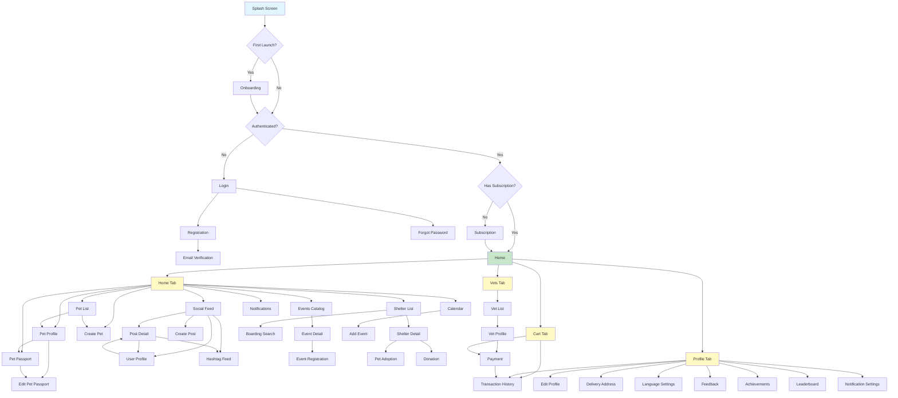

# Диаграмма роутинга приложения Pet Care

## Общая схема навигации

## Детальная структура маршрутов

### 1. Аутентификация и Onboarding
- `/` - Splash Screen
- `/onboarding` - Onboarding
- `/auth` - Login
- `/registration` - Registration
- `/verification?email=...` - Email Verification
- `/forgot-password` - Forgot Password

### 2. Главный экран (Home)
- `/home` - Home Page (с табами)

#### 2.1. Home Tab
- `/pets` - Pet List (встроен в HomeScreenContent)
- `/pets/:id` - Pet Profile
- `/pets/create` - Create Pet
- `/pets/:id/passport` - Pet Passport
- `/pets/:id/passport/edit` - Edit Pet Passport
- `/social` - Social Feed
- `/social/posts/:id` - Post Detail
- `/social/users/:id` - User Profile
- `/social/hashtags/:hashtag` - Hashtag Feed
- `/social/create-post` - Create Post
- `/events` - Events Catalog
- `/events/:id` - Event Detail
- `/events/:id/register` - Event Registration
- `/charity/shelters` - Shelter List
- `/charity/shelters/:id` - Shelter Detail
- `/charity/adoption?petId=...&shelterId=...` - Pet Adoption
- `/charity/donation?shelterId=...` - Donation
- `/charity/boarding` - Boarding Search
- `/calendar` - Calendar
- `/calendar/add-event?date=...&id=...` - Add Event
- `/notifications` - Notifications

#### 2.2. Cart Tab
- `/cart` - Cart (встроен в HomePage)
- `/payment?serviceId=...&orderId=...&serviceType=...` - Payment
- `/transactions` - Transaction History

#### 2.3. Vets Tab
- `/vets` - Vet List (встроен в HomePage)
- `/vets/:id` - Vet Profile
- `/payment?serviceId=...&orderId=...&serviceType=...` - Payment (из Vet Profile)

#### 2.4. Profile Tab
- `/profile` - Profile (встроен в HomePage)
- `/settings/edit-profile` - Edit Profile
- `/settings/delivery-address?select=true` - Delivery Address
- `/settings/language` - Language Settings
- `/settings/feedback` - Feedback
- `/achievements` - Achievements
- `/leaderboard` - Leaderboard
- `/notification-settings` - Notification Settings
- `/transactions` - Transaction History

### 3. Подписки
- `/subscription` - Subscription Page

## Проверка доступности экранов

### ✅ Доступны из навигации:
1. **Home Tab:**
   - ✅ Pet List (встроен в HomeScreenContent)
   - ✅ Pet Profile (из Pet List)
   - ✅ Create Pet (из Pet List)
   - ✅ Pet Passport (из Pet Profile)
   - ✅ Edit Pet Passport (из Pet Passport)
   - ✅ Social Feed (из HomeScreenContent)
   - ✅ Post Detail (из Social Feed)
   - ✅ Create Post (из Social Feed)
   - ✅ User Profile (из Post Detail)
   - ✅ Hashtag Feed (из Post Detail)
   - ✅ Events Catalog (из HomeScreenContent)
   - ✅ Event Detail (из Events Catalog)
   - ✅ Event Registration (из Event Detail)
   - ✅ Shelter List (из HomeScreenContent)
   - ✅ Shelter Detail (из Shelter List)
   - ✅ Pet Adoption (из Shelter Detail)
   - ✅ Donation (из Shelter Detail)
   - ✅ Boarding Search (из HomeScreenContent)
   - ✅ Calendar (из HomeScreenContent)
   - ✅ Add Event (из Calendar)
   - ✅ Notifications (из HomeScreenContent)

2. **Cart Tab:**
   - ✅ Cart (встроен в HomePage)
   - ✅ Payment (из Cart)
   - ✅ Transaction History (из Cart)

3. **Vets Tab:**
   - ✅ Vet List (встроен в HomePage)
   - ✅ Vet Profile (из Vet List)
   - ✅ Payment (из Vet Profile)

4. **Profile Tab:**
   - ✅ Profile (встроен в HomePage)
   - ✅ Edit Profile (из Profile)
   - ✅ Delivery Address (из Profile)
   - ✅ Transaction History (из Profile)
   - ✅ Language Settings (из Profile)
   - ✅ Feedback (из Profile)
   - ✅ Achievements (из Profile)
   - ✅ Leaderboard (из Profile)

### ⚠️ Требуют проверки:
- Все экраны должны быть доступны из соответствующих точек входа
- Нужно проверить, что HomeScreenContent имеет ссылки на все основные экраны

## Рекомендации по улучшению навигации

1. **Добавить быстрый доступ к часто используемым экранам:**
   - Кнопка "Создать пост" в AppBar Social Feed
   - Кнопка "Добавить событие" в AppBar Calendar
   - Кнопка "Добавить питомца" в AppBar Pet List

2. **Улучшить навигацию между связанными экранами:**
   - Из Event Detail можно перейти к Event Registration
   - Из Shelter Detail можно перейти к Pet Adoption и Donation
   - Из Vet Profile можно перейти к Payment

3. **Добавить deep linking:**
   - Поддержка прямых ссылок на события, посты, приюты
   - Поддержка уведомлений с переходом на конкретные экраны

